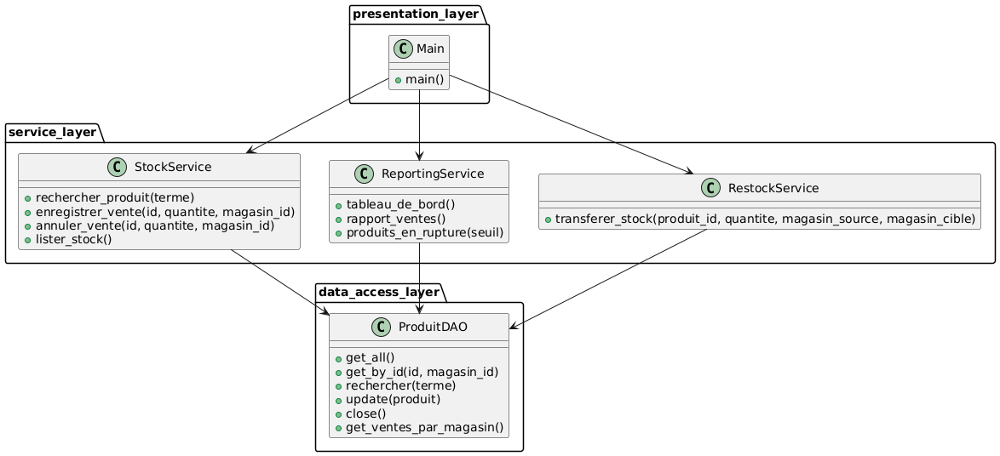
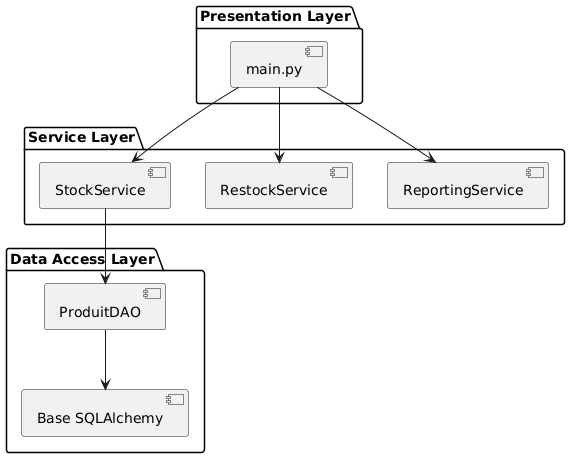
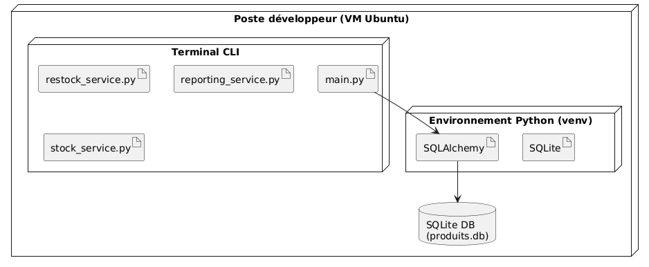
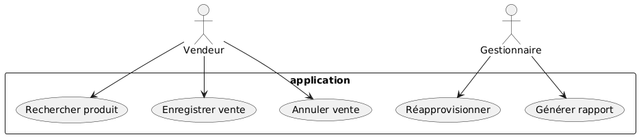
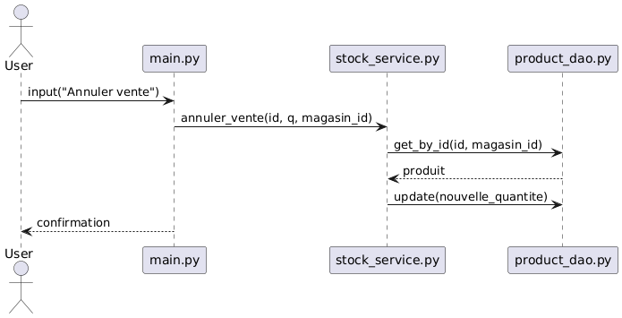
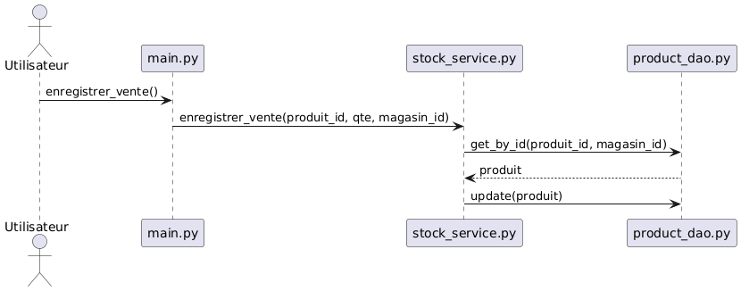
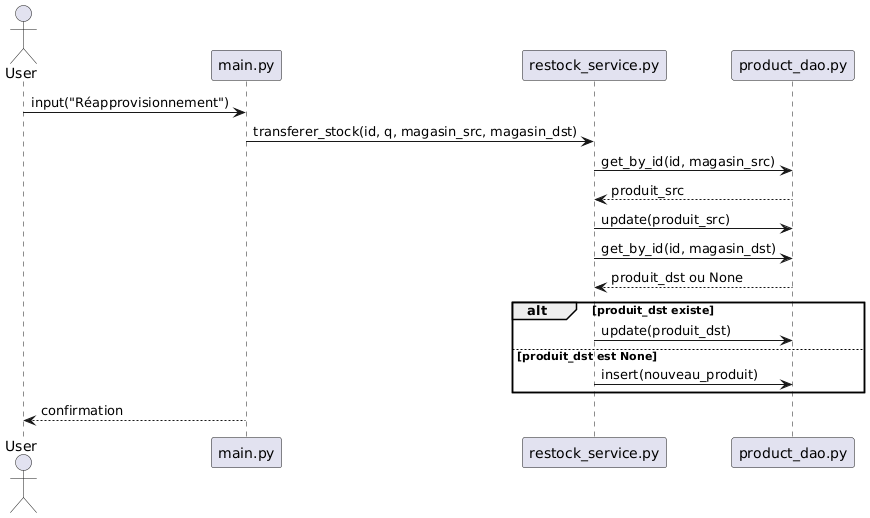
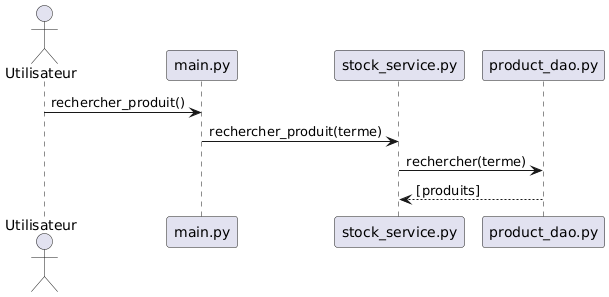
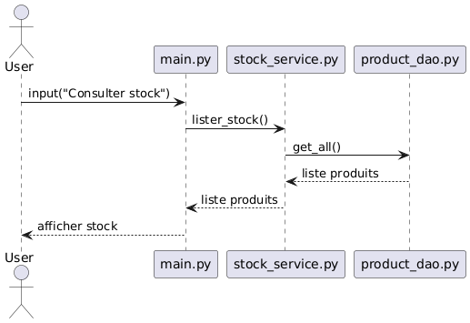
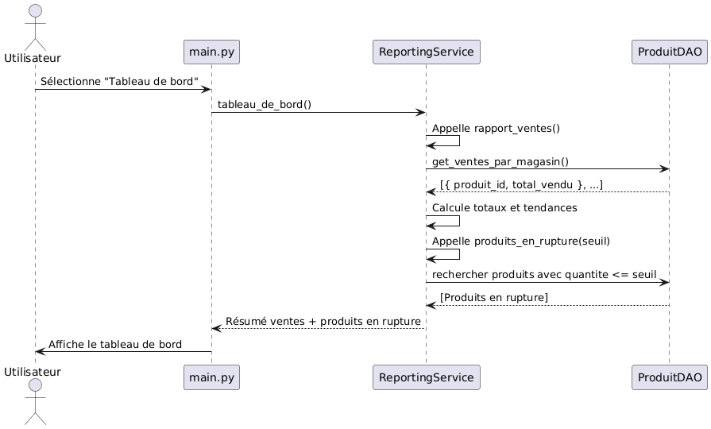

# LOG430 - Étape 1
```
Nom: Ludovic Marcoux Hoyos
Groupe: 02
Session: Été 2025
```

## Description
Ce projet est une application console qui gère le stock et les ventes d'une compagnie. 

## L'architecture

# Architecture du système

Le système est organisé selon une architecture en couches, favorisant la séparation des responsabilités, la testabilité et l’évolutivité.

## 1. Couche `data_access_layer`

Cette couche gère la persistance des données à l’aide de SQLAlchemy.

- **Modèles** :
  - `Produit` : représente les produits disponibles dans les magasins.
  - `Vente` : représente les ventes réalisées.

- **DAO (`ProduitDAO`)** :
  - `get_by_id(id, magasin_id)`
  - `rechercher(terme)`
  - `update(produit)`
  - `get_all()`
  - `get_ventes_par_magasin()`
  - `close()`

## 2. Couche `service_layer`

Cette couche contient la logique métier du système. Elle repose sur `ProduitDAO` pour effectuer ses opérations.

- **`StockService`** :
  - `rechercher_produit(terme)`
  - `enregistrer_vente(id, quantite, magasin)`
  - `annuler_vente(id, quantite, magasin)`
  - `lister_stock()`

- **`RestockService`** :
  - `transferer_stock(produit_id, quantite, magasin_source, magasin_cible)`
  - `get_ventes_par_magasin()`

- **`ReportingService`** :
  - `tableau_de_bord()`
  - `rapport_ventes()`
  - `produits_en_rupture(seuil)`

## 3. Couche `presentation_layer`

Cette couche est responsable de l’interaction avec l’utilisateur via le terminal.

- **`main.py`** :
  - Affiche un menu CLI
  - Collecte les choix utilisateurs
  - Appelle les méthodes de services correspondantes

# Besoins fonctionnels et non-fonctionnels

## ✅ Besoins fonctionnels

Ce système permet aux utilisateurs de gérer le stock et d’effectuer des opérations de vente, de réapprovisionnement et de suivi, via une interface terminale.

### 1. Gestion du stock
- Consulter la liste des produits en stock pour un magasin donné.
- Rechercher un produit par nom ou mot-clé.
- Enregistrer une vente (réduction de la quantité d’un produit).
- Annuler une vente (restauration de la quantité d’un produit).

### 2. Réapprovisionnement entre magasins
- Transférer du stock d’un produit d’un magasin source vers un magasin cible.
- Créer automatiquement le produit dans le magasin cible si celui-ci n'existe pas encore.

### 3. Tableau de bord / Reporting
- Générer un rapport de ventes par magasin.
- Afficher la liste des produits en rupture de stock (selon un seuil configurable).

### 4. Interface utilisateur
- Fournir un menu textuel interactif accessible via le terminal.
- Permettre à l’utilisateur de naviguer entre les fonctionnalités du système.

---

## ✅ Besoins non-fonctionnels

### 🔧 Architecture et conception
- Respect de l’architecture en couches (`data_access_layer`, `service_layer`, `presentation_layer`).
- Modélisation du système via les diagrammes UML (4+1) avec PlantUML :
  - Vue logique (classes)
  - Vue processus (séquences)
  - Vue déploiement
  - Vue implémentation (fichiers et modules)
  - Vue cas d'utilisation

### 🔍 Testabilité
- Tests unitaires complets avec `unittest`.
- Utilisation d’une base de données SQLite en mémoire pour exécuter les tests.

### 🧩 Extensibilité
- L’architecture permet d’ajouter facilement de nouvelles fonctionnalités.
- La logique métier est découplée des détails de persistance.

### 💡 Maintenabilité
- Le projet est analysé avec `pylint` (objectif ≥ 9.5/10).
- Organisation claire des fichiers et responsabilités.

### ⚡ Performance
- Les opérations de vente, de transfert et de reporting sont optimisées pour un traitement rapide.
- Approche simplifiée sans surcoût pour un projet pédagogique.

### 💾 Persistance
- Utilisation de SQLAlchemy pour la gestion des entités et la base de données SQLite.

### 🚀 Déploiement
- Exécutable dans une machine virtuelle Ubuntu avec Python 3.
- Pas de dépendance complexe : uniquement `sqlalchemy`, `plantuml`, et `unittest`.


## Justification des décisions d'architecture. (ADR)

## 1 - Choix de la base de données, [ADR](docs/ADR/ADR-BD.md)

### Statut : Accepté
### Date : 2025-06-09
### Décision 
    Utilisation de SQLite comme base de données relationnelle locale.

### Contexte
    Le système de gestion de stock devait persister les produits, magasins et ventes. Les exigences précisaient qu’aucun serveur HTTP ou API REST n'était requis, et que la base devait fonctionner localement sur la VM.

### Choix possibles

    JSON/CSV : trop fragile pour la cohérence transactionnelle.

    MongoDB (NoSQL) et PostgreSQL: trop complexe pour un usage local et non nécessaire.

    SQLite : simple, léger, intégré avec Python, supporte les contraintes (clés primaires composées, jointures).

### Conséquences

    Facile à intégrer sans configuration serveur.

    Compatible avec le module sqlite3 natif.

    Limite la scalabilité en cas d’accès concurrent élevé

## 2 - Séparation des responsabilités, [ADR](docs/ADR/ADR-Separation.md)

### Statut : Accepté
### Date : 2025-06-09
### Décision
    Utilisation d’une architecture en 3 couches (présentation, service, accès aux données).
### Contexte :
    Le projet devait s'étendre dans les labos suivants, notamment pour prendre en charge de nouveaux UC (UC4–UC7 qui n'ont pas été implémentées encore à cette étape). La modularité et la testabilité devenaient cruciales.

### Choix possibles

    Application monolithique dans un seul fichier (rapide, mais non maintenable).

    Architecture MVC : autre option possible et interessante (plus utile pour utilisation web)

    Architecture en couches : claire, modulaire, évolutive.

### Conséquences

    Le dossier presentation_layer gère l'IHM en console.

    Le dossier service_layer isole la logique métier.

    Le dossier data_access_layer encapsule les opérations SQLite.

    Les tests peuvent être faits indépendamment sur chaque couche.

## Choix technologiques

🐍 Python

    Pourquoi ? Langage simple, lisible, et très populaire pour les projets éducatifs et prototypes.

    Avantage clé : Écosystème riche (librairies, frameworks), rapidité de développement, excellente compatibilité avec les outils de test, de CI/CD, et de conteneurisation.

🗃️ SQLite

    Pourquoi ? Base de données légère et embarquée, parfaite pour les applications simples sans serveur SGBD.

    Avantage clé : Aucune configuration serveur, fichier local produits.db, idéal pour déploiement rapide ou démonstration.

🧱 SQLAlchemy (ORM)

    Pourquoi ? Permet d’interagir avec la base de données via des objets Python plutôt qu’avec du SQL brut.

    Avantage clé : Abstraction de la logique SQL, rend la couche DAO testable en mémoire avec SQLite, tout en restant compatible avec d'autres SGBD.

📦 Architecture à trois couches (DAO / Service / Présentation)

    Pourquoi ? Séparation claire des responsabilités (accès aux données, logique métier, interface utilisateur).

    Avantage clé : Facilite les tests, la maintenance, et l’évolution vers des architectures plus complexes (ex: API REST, Frontend).

🧪 unittest (module Python standard)

    Pourquoi ? Intégré à Python, facile à configurer, compatible avec les pipelines CI.

    Avantage clé : Permet l’automatisation rapide des tests sans dépendance externe.

🐳 Docker + Docker Compose

    Pourquoi ? Facilite le déploiement, l’isolation de l’environnement, et la portabilité du projet.

    Avantage clé : Une seule commande (docker-compose up) suffit pour lancer toute l’application, peu importe l’environnement hôte.

⚙️ GitHub Actions (CI/CD)

    Pourquoi ? Intégration directe avec GitHub pour automatiser les tests, la construction Docker et les déploiements.

    Avantage clé : Automatisation fiable et gratuite pour projets open source, renforce la qualité du code.


## Diagrammes

### Vue Logique



### Vue d'implémentation



### Vue de deploiement



### Vue d'implémentation


### Vue de cas d'utilisation



## Diagrammes de séquence (processus)

### Annuler vente

### Enregistrer vente

### Reapprovisionnement

### Rechercher produit

### Voir stock

### Afficher tableau de bord


## Instruction d'installation et d'execution

### Cloner
Git bash: `git clone https://github.com/Ludo67/LOG430-Lab0.git`

### Installer .venv.
Installer un .venv. voir (https://packaging.python.org/en/latest/guides/installing-using-pip-and-virtual-environments/)

### Installer dépendances
`pip install -r requirements.txt`

### Docker commands to build (terminal)
`docker build -t my-app .`
`docker-compose up`
`docker run -it my-app`

### Executer les tests unitaires

Terminal: `pytest`

## Instruction pour l'environnement de production

Dans la machine virtuelle, voici des commandes à utiliser.

### Télécharger la plus nouvelle version sur docker hub

`docker pull ludo678/my-app:latest`

# 📦 CI/CD Pipeline – Description des étapes

Ce pipeline GitHub Actions automatise les étapes de **linting**, **tests**, **build Docker**, et **publication** sur Docker Hub lors d’un `push` ou `pull_request` sur n’importe quelle branche.

---

## ⚙️ Déclencheurs

```yaml
on:
  push:
    branches: [ "*" ]
  pull_request:
    branches: [ "*" ]


